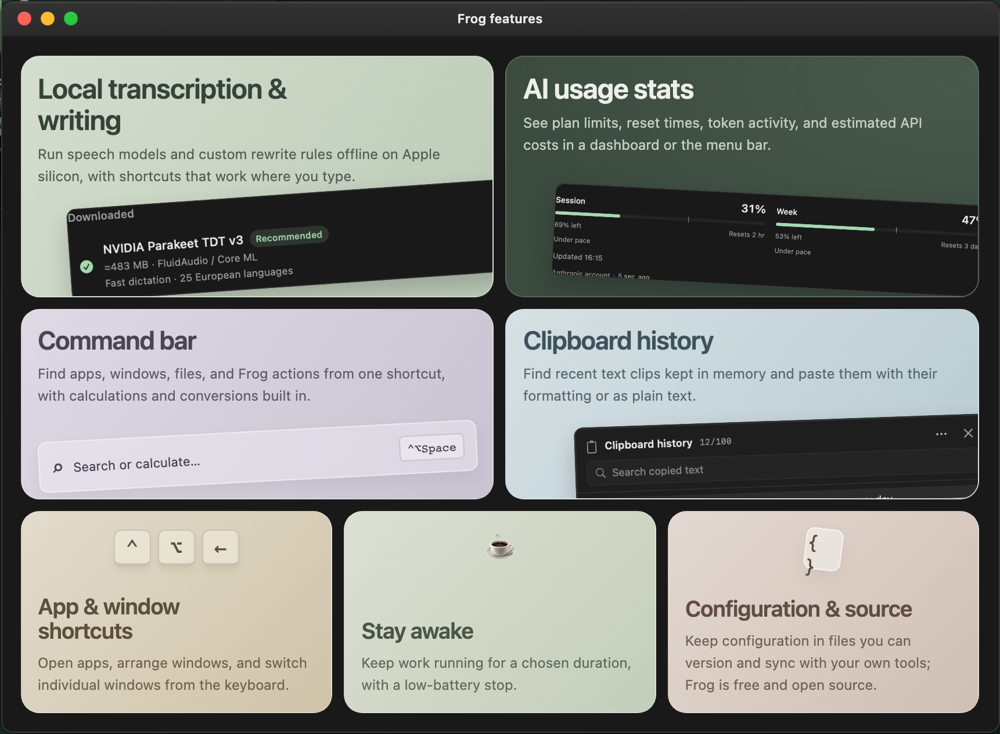
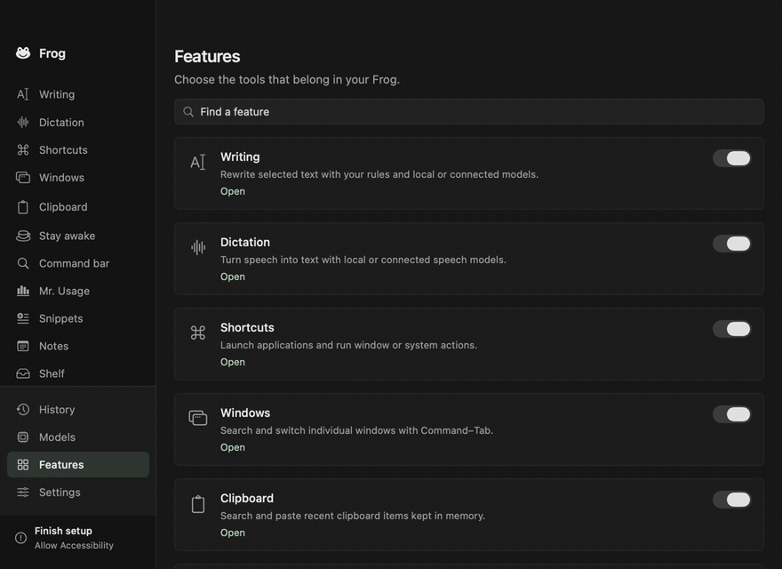

# Frog

[](https://github.com/t1llo/frog/actions/workflows/native.yml)
[](https://github.com/t1llo/frog/releases/latest)


A native, local-first macOS toolkit for writing, dictation and everyday shortcuts.

**[Website](https://frog.beffa.xyz/)** · **[Download](https://github.com/t1llo/frog/releases/latest)**



## See it in action

[](docs/media/frog-toolkit.mp4)

**[Watch the 24-second recording](docs/media/frog-toolkit.mp4)** · Native app UI, sample data.

## Tools

| | |
| --- | --- |
| **Writing & dictation** | Local speech models, custom rewrite rules, connected providers and installed AI tools. |
| **Command bar & windows** | App/file and macOS settings search, calculations, conversions, window switching and layout shortcuts. |
| **Clipboard & documents** | Searchable clipboard, snippets, Markdown notes, file/link shelf and saved scripts. |
| **Mr. Usage** | Claude/OpenAI limits, token charts and estimated costs; combined OpenCode + Codex activity. |
| **Menu bar & Stay awake** | Hide/reveal icons, auto-hide, timed awake sessions and low-battery stop. |
| **System monitor** | CPU/GPU charts, disk capacity and I/O, battery power and thermal status in an optional Frog menu view. |
| **Personalization** | Ten themes including Tokyo Night, transparency, editable config files and optional local statistics. |

Enable tools individually in **Features**. No Frog account. No telemetry.

Window switcher and Clipboard shortcuts are configured in their Features cards;
clipboard entries live in **History**. **Shortcuts** groups Application, Windows
and Other actions.
Enable **System monitor** to switch between **Frog** and **System** in the menu-bar
popup. Readings refresh only while visible; unsupported metrics show as unavailable.

## Install

**[Download the latest release](https://github.com/t1llo/frog/releases/latest)**, open the DMG (or unzip the ZIP), and move **Frog.app** to **Applications**.

macOS 14+ · Apple silicon and Intel · Built-in model inference requires Apple silicon.

Local models stay on your Mac; connected providers use their own services. API keys live in Keychain. Permissions are feature-specific. **[Privacy](docs/privacy.md)**

## Build

Requires Xcode with Swift 6.3+ (CI uses Xcode 27).

```sh
export DEVELOPER_DIR=/Applications/Xcode.app/Contents/Developer
swift test -c release
make build
open dist/Frog.app
```

See [Development](docs/development.md) for signing and packaging.

## Guides

[Configuration and themes](docs/configuration.md) · [Providers](docs/providers.md) · [Local models](docs/local-model-sources.md) · [Installed AI tools](docs/local-tool-providers.md) · [Mr. Usage](docs/usage-integration.md) · [Statistics](docs/statistics.md) · [Stay awake](docs/stay-awake.md) · [Verification](docs/verification.md)
