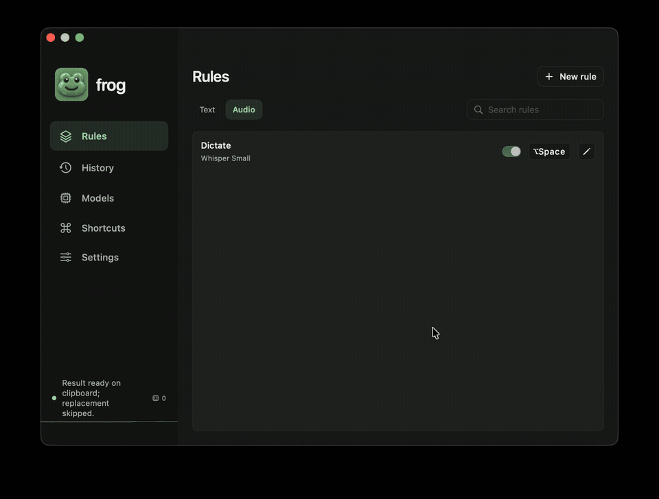

# Frog

[](https://github.com/t1llo/frog/actions/workflows/native.yml)
[](https://github.com/t1llo/frog/releases/latest)


A native, local-first macOS toolkit for writing, dictation and everyday shortcuts.

**[Website](https://frog.beffa.xyz/)** · **[Download](https://github.com/t1llo/frog/releases/latest)**

- **Write and dictate.** Rewrite selected text with your own rules, or turn speech into text with models running on your Mac. Choose local models, connected providers, or your already-authenticated Claude Code, Codex and OpenCode tools.
- **Find and act.** Search apps, windows, files and Frog commands from the command bar. Switch individual windows with **Command–Tab**, arrange them, calculate, convert units and run quick actions.
- **Keep useful things close.** Search clipboard history, insert reusable snippets, write Markdown notes, collect files and links on a shelf, and run saved scripts.
- **See your AI usage.** Integrated **Mr. Usage** shows Claude/OpenAI plan limits and activity in a compact menu-bar popup, with token breakdowns, model estimates and available account history in the dashboard. OpenAI combines OpenCode and Codex activity automatically.
- **Tidy your menu bar.** Use a divider and reveal arrow, optional auto-hide, an always-hidden section and a shortcut. Keep background work running with timed **Stay awake** sessions.

Enable the tools you want in **Features**. Frog needs no account of its own and includes no telemetry.



## Install

Download **Frog-macOS.zip**, unzip it, and move **Frog.app** to **Applications**. The setup assistant helps you download local models, connect a provider, or import settings, then review permissions. Every step is optional; reopen it from Settings anytime.

macOS 14+ · Apple silicon and Intel · Built-in model inference requires Apple silicon.

Source may include features newer than the latest download; see the release notes for your build.

## Make it yours

- Choose from ten themes, including **Tokyo Night**, and customize semantic colors, with separate app and popup transparency and native background blur.
- Edit commented `key=value` settings in `~/.config/frog/config`; rules and other structured settings live in `config.json`. UI changes and text settings stay in sync, with reload, backups and portable export. The format supports dotfile managers such as chezmoi.
- Review, disable or reset on-device statistics for successful actions, dictation time and words. Clipboard history stays in memory; saved writing history is optional.
- Use **Models → Installed tools** to connect Claude Code, Codex or OpenCode. Those tools manage their own authentication. Codex execution currently supports **0.159.x**; see the [integration guide](docs/local-tool-providers.md) for restrictions and tool-history behavior.

For menu-bar organization, enable **Menu bar**, then **⌘-drag** icons to the left of its divider. Click the arrow to reveal or hide them, right-click for options, or Option-click to arrange every section. Quit other menu-bar organizers before enabling Frog's organizer.

## Privacy and permissions

Local models process text and speech on your Mac. Connected providers and installed AI tools send requests according to their own configuration. Provider API keys stay in Keychain; installed tools retain ownership of their credentials.

Features request the macOS access they need, such as microphone access for dictation or Accessibility for text replacement and window control. Optional Usage collection reads local tool counters and supported account-limit endpoints; it does not upload transcripts. API-cost figures are estimates, not subscription bills. See [Privacy](docs/privacy.md) and [Usage integration](docs/usage-integration.md) for data boundaries and supported sources.

## Build

Requires Xcode with Swift 6.3+ (CI uses Xcode 27).

```sh
export DEVELOPER_DIR=/Applications/Xcode.app/Contents/Developer
swift test -c release
make build
open dist/Frog.app
```

`make build` uses an available Developer ID identity or falls back to ad-hoc signing. See [Development](docs/development.md) for packaging, signing and verification.

## Guides

[Configuration and themes](docs/configuration.md) · [Providers](docs/providers.md) · [Local models](docs/local-model-sources.md) · [Installed AI tools](docs/local-tool-providers.md) · [Mr. Usage](docs/usage-integration.md) · [Statistics](docs/statistics.md) · [Stay awake](docs/stay-awake.md) · [Verification](docs/verification.md)
