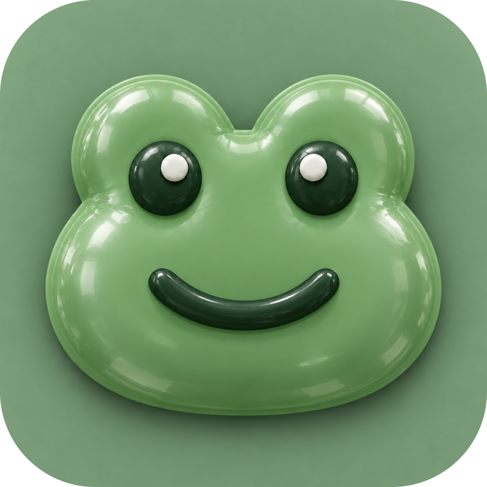
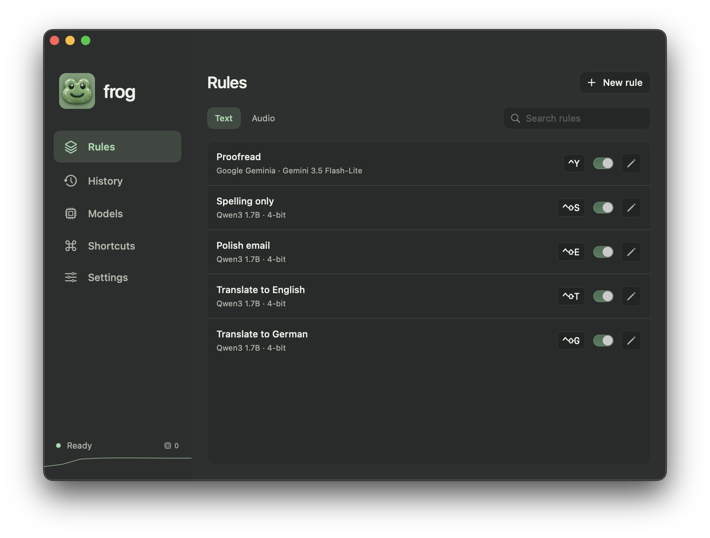
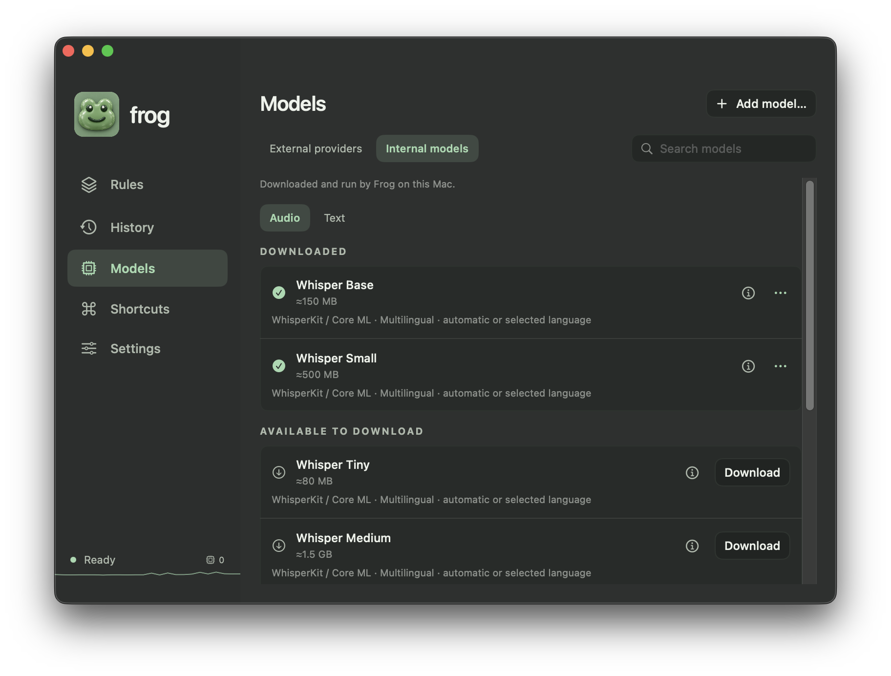

# Frog

[](https://github.com/t1llo/frog/actions/workflows/native.yml)
[](https://github.com/t1llo/frog/releases/latest)


Native macOS shortcuts for writing, dictation and switching between windows.

**[Website](https://frog.beffa.xyz/)** · **[Download](https://github.com/t1llo/frog/releases/latest)**



- Rewrite selected text with customizable rules and shortcuts.
- Dictate with local speech models or external transcription providers.
- Use downloaded models, OpenAI, Claude, Gemini, Ollama or LM Studio.
- Switch between individual windows with **Command–Tab**.
- Keep API keys in Keychain and history optional. No account or analytics.

## Screenshots

**Internal models**




## Install

Download **Frog-macOS.zip**, unzip it, and move **Frog.app** to **Applications**. The setup assistant helps you download local models, connect a provider, or import settings, then review permissions. Every step is optional; reopen it from Settings anytime.

macOS 14+ · Apple silicon and Intel · Built-in model inference requires Apple silicon.

Source may include features newer than the latest download; see the release notes for your build.

## Build

Requires Xcode with Swift 6.3+ (CI uses Xcode 27).

```sh
export DEVELOPER_DIR=/Applications/Xcode.app/Contents/Developer
swift test
bash scripts/build-app.sh
open dist/Frog.app
```

[Providers](docs/providers.md) · [Local models](docs/local-model-sources.md) · [Configuration](docs/configuration.md) · [Privacy](docs/privacy.md) · [Development](docs/development.md)
