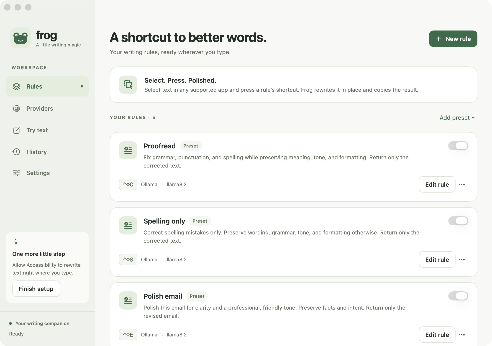
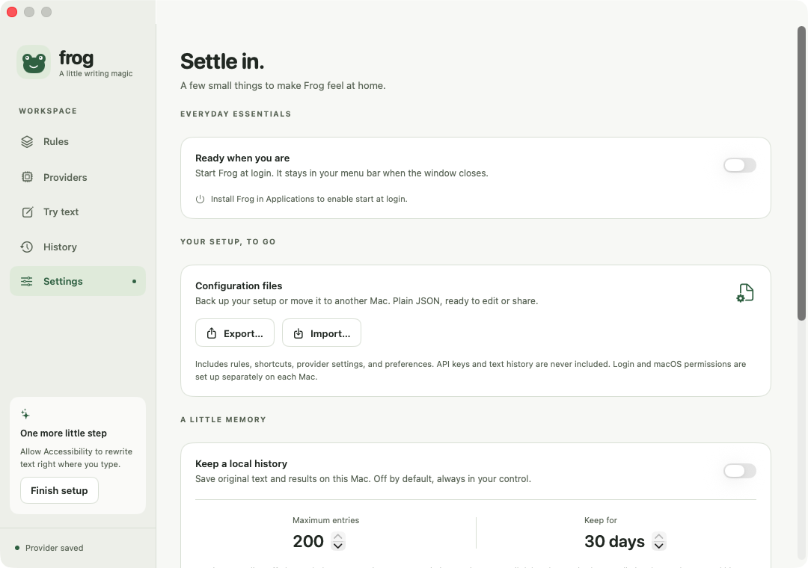

# Frog

A small macOS menu-bar utility for writing and window switching. Rewrite selected text in place, or use Command–Tab to switch directly between individual windows.

**[Download](https://github.com/t1llo/frog/releases)** · macOS 14+ · Apple silicon and Intel

<picture>
  <source media="(prefers-color-scheme: dark)" srcset="docs/images/frog-dark.png">
  
</picture>

## What it does

- Proofread, fix spelling, polish emails, and translate with built-in rules.
- Create your own rules, each with its own shortcut, language, provider, and model.
- Use OpenAI, Claude, Gemini, an OpenAI-compatible service, or local models through Ollama and LM Studio.
- Configure your models once, choose a default, and pick model overrides for individual rules.
- Export and import your setup as an editable JSON file.
- Keep an optional local history. It’s off by default.
- Dictate with downloadable local speech models and lightweight text cleanup on Apple silicon; choose hold/toggle recording and copy/paste delivery.
- Create application-launch shortcuts and open a configurable shortcut-reference panel.
- Customize accent color and window transparency in Settings or configuration JSON.
- Switch between individual windows with **Command–Tab**, including minimized windows and multiple windows from the same app.

No Frog account, analytics, or telemetry. Bring your own API key, or use a local model.

## Install

1. Download **Frog-macOS.zip** from [Releases](https://github.com/t1llo/frog/releases), unzip it, and move **Frog.app** to **Applications**.
2. Open Frog, add a provider, and select its models. For Ollama or LM Studio, start the local server and click **Find installed models**. [Provider setup](docs/providers.md).
3. Allow Frog in **System Settings → Privacy & Security → Accessibility** for writing shortcuts and window switching.

Published build 6 is Developer ID signed and notarized by Apple. Window switching and local workflows are in the newer source/local builds; check the release notes for the build available to download. You can also [build from source](#build-from-source).

## Use it

Select text in an editable field, then press **Control + Shift + C** to proofread. Change shortcuts and instructions in **Rules**. Other presets cover spelling, email polishing, and translation to English or German.

Frog sends selected text and your rule to the chosen text provider (or built-in local model), copies the result, and replaces the selection. If you move to another field or the app can’t safely edit it, the result stays on your clipboard.

Closing the window keeps Frog in the menu bar. Enable **Start at login** in Settings if you want it available after a restart.

### Window switcher

Hold **Command** and tap **Tab** to cycle individual windows. Add **Shift** to go backwards, use the arrow keys to navigate, and release **Command** to bring the selected window forward. **Escape** cancels; clicking a row switches directly.

The list shows titles and app icons, with recently used windows first. Keep holding Command and type to fuzzy-find a window by title or app name; Tab cycles matches. Quick taps use a cached list without flashing the overlay. Minimized windows and windows in hidden apps are included. Other Spaces are included when the app exposes those windows through Accessibility. Turn the feature off in **Windows** or Frog’s menu to restore the macOS app switcher.

### Local transcription

On Apple silicon, open **Transcription**, allow microphone access, and download a Whisper speech model plus a Qwen local cleanup model. Configure the Dictate rule's shortcut in **Rules**. Choose press-to-toggle or hold-to-record and copy-only or copy-and-paste in Settings; rules can override these defaults. The optional popup shows live partial text and stop/cancel controls. Shared history stays optional. Providers also lists downloadable local text models that can be used for ordinary writing rules.

## Your settings and data

**Settings → Export / Import** moves rules, shortcuts, provider settings, and preferences between Macs. API keys stay in Keychain; text history isn’t included. Imports validate the file and back up your previous configuration. [Configuration format](docs/configuration.md).

Frog has no usage tracking or backend service. Cloud providers receive text only when you run a rule or test a connection. Local providers use the endpoint you configure. Optional history stays on your Mac and can be cleared at any time. [Privacy details](docs/privacy.md).

<details>
<summary>Settings screenshot</summary>



</details>

## Build from source

Requires Xcode 26+ / Swift 6.2+. Open `native/Frog.xcodeproj` and run the **Frog-macOS** scheme, or:

```sh
export DEVELOPER_DIR=/Applications/Xcode.app/Contents/Developer
swift test
bash scripts/build-app.sh
open dist/Frog.app
```

Set `FROG_UNIVERSAL=1` when building for both CPU architectures. The app is written in SwiftUI and has no third-party package dependencies.

[Build and release notes](docs/development.md) · Verification status
